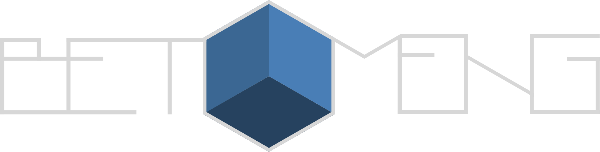

# Betomeng

DJ Portfolio

<div style="background: black; padding: 25px 20px 20px; width: 460px">
  
</div>

Built with:
[Gridsome](https://www.gridsome.org/),
[TailwindCSS](https://tailwindcss.com/) &
[GreenSock](https://greensock.com/)

## Quick start

Install all dependencies:
```bash
yarn install
```

Run development server:
```bash
gridsome develop
```

Build static site:
```bash
gridsome build
```

This command will generate a static site inside a `./dist` directory

For more check out [Gridsome docs page](https://gridsome.org/docs/)

© Milos Djakovic
